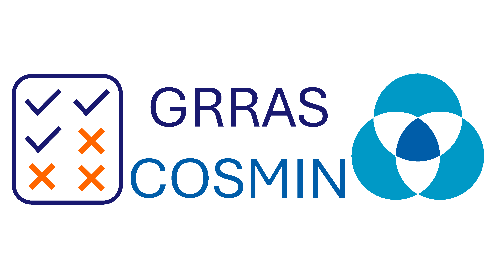

## **Welcome to the GRRAS-COSMIN website!**

We are updating the **G**uidelines for **R**eporting **R**eliability and **A**greement **S**tudies (**GRRAS**) in collaboration with the **CO**nsensus-based **S**tandards for the selection of health **M**easurement **IN**strumentsinitiative (**COSMIN**) intiative to create a new, consensus-based reporting guideline for reliability and agreement/measurement error studies: the GRRAS-COSMIN guideline.

{width=75% fig-align="center"}

The original [**GRRAS**](https://doi.org/10.1016/j.jclinepi.2010.03.002) were published in 2011. While still widely used, they may no longer reflect current methodological and reporting standards in health research. Since then, significant advances have been made in the design and analysis of reliability and agreement studies — including sample size determination and other statistical considerations. Moreover, the original GRRAS were developed before formal guidance for reporting guideline development became available.

An update is therefore needed to align GRRAS with current best practices and improve its usability.\
The updated guideline will harmonize terminology and concepts with related initiatives such as [**COSMIN**](https://www.cosmin.nl/), [**QAREL**](https://doi.org/10.1016/j.jclinepi.2009.10.002), [**STARD**](https://doi.org/10.1136/bmjopen-2016-012799), and [**QUADAS**](http://dx.doi.org/10.1055/s-0029-1245723), ensuring consistency across frameworks addressing measurement properties, risk of bias, and reporting quality.

## Who are we?

The GRRAS-COSMIN core project group comprises researchers with experience in reporting guideline development and Delphi studies, methodologists, statisticians, and content experts. This includes representatives from the original GRRAS group and COSMIN. The core project group is responsible for project administration.

Meet our steering committee members [here](team.qmd).

**Contact point**: [Merle-Marie Pittelkow](https://klinische-pflegewissenschaft.charite.de/metas/person/person/address_detail/merle_marie_pittelkow), on behalf of the GRRAS COSMIN steering committee, Charité Universtitätsmedizin Berlin, Institute for Clinical Nursing Science, Berlin, Germany. <a href="mailto:merle-marie@charite.de" class="email-link"> <i class="bi bi-envelope-fill"></i> Get in touch. </a>

### Funding

This project is funded by the Deutsche Forschungsgemeinschaft (DFG) - Project number 560535232. The grant application is available [here](https://gepris.dfg.de/gepris/projekt/560535232).

{width=50% fig-align="center"}
